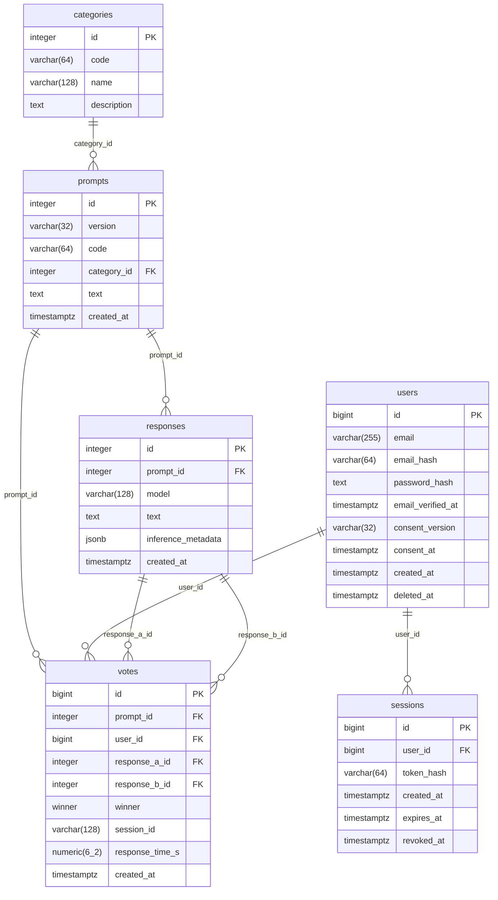

# Database schema

ER diagram of the Arena Cat data schema.

> Source: [`backend/app/models.py`](../backend/app/models.py).

## Constraints and indexes

| Table | Type | Name | Definition |
|-------|------|------|------------|
| categories | UNIQUE | — | `(code)` |
| prompts | UNIQUE | `uq_prompts_version_code` | `(version, code)` |
| prompts | FK | — | `category_id → categories.id` |
| responses | UNIQUE | `uq_responses_prompt_model` | `(prompt_id, model)` |
| responses | UNIQUE | `uq_responses_prompt_id_id` | `(prompt_id, id)` |
| responses | FK | — | `prompt_id → prompts.id` `ON DELETE CASCADE` |
| users | UNIQUE | — | `(email)` |
| users | UNIQUE | — | `(email_hash)` |
| users | CHECK | `ck_users_active_have_credentials` | `deleted_at IS NOT NULL OR (email IS NOT NULL AND email_hash IS NOT NULL AND password_hash IS NOT NULL AND consent_at IS NOT NULL)` |
| sessions | FK | — | `user_id → users.id` |
| sessions | UNIQUE | — | `(token_hash)` |
| sessions | INDEX | `ix_sessions_user_id` | `user_id` |
| votes | CHECK | `ck_votes_responses_different` | `response_a_id <> response_b_id` |
| votes | FK | — | `prompt_id → prompts.id` |
| votes | FK | `fk_votes_user_id_users` | `user_id → users.id` `ON DELETE SET NULL` |
| votes | FK | `fk_votes_response_a` | `(prompt_id, response_a_id) → responses(prompt_id, id)` |
| votes | FK | `fk_votes_response_b` | `(prompt_id, response_b_id) → responses(prompt_id, id)` |
| votes | INDEX | `ix_votes_prompt_id` | `prompt_id` |
| votes | INDEX | `ix_votes_created_at` | `created_at` |
| votes | INDEX | `ix_votes_user_id` | `user_id` |

## Enums

- **`winner`**: `a`, `b`, `tie`, `neither`
