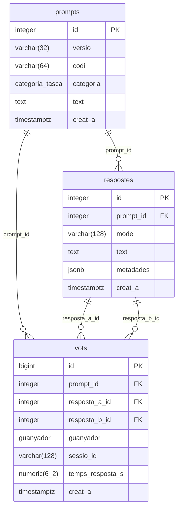

# Esquema de la base de dades

Diagrama ER de l'esquema de dades d'Arena Cat.

> Font: [`backend/app/models.py`](../backend/app/models.py) — sincronitzeu el diagrama quan canviï l'esquema.

## Restriccions i índexs

| Taula | Tipus | Nom | Definició |
|-------|-------|-----|-----------|
| prompts | UNIQUE | `uq_prompts_versio_codi` | `(versio, codi)` |
| respostes | UNIQUE | `uq_respostes_prompt_model` | `(prompt_id, model)` |
| respostes | FK | — | `prompt_id → prompts.id` `ON DELETE CASCADE` |
| vots | CHECK | `ck_vots_respostes_diferents` | `resposta_a_id <> resposta_b_id` |
| vots | FK | — | `prompt_id → prompts.id` |
| vots | FK | — | `resposta_a_id → respostes.id` |
| vots | FK | — | `resposta_b_id → respostes.id` |
| vots | INDEX | `ix_vots_prompt_id` | `prompt_id` |
| vots | INDEX | `ix_vots_creat_a` | `creat_a` |

## Enums

- **`categoria_tasca`**: `correccio`, `reformulacio`, `traduccio`
- **`guanyador`**: `a`, `b`, `empat`, `cap`
