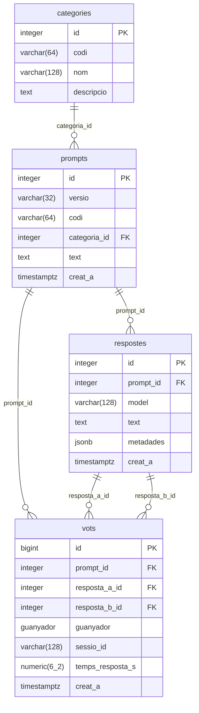

# Esquema de la base de dades

Diagrama ER de l'esquema de dades d'Arena Cat.

> Font: [`backend/app/models.py`](../backend/app/models.py).

## Restriccions i índexs

| Taula | Tipus | Nom | Definició |
|-------|-------|-----|-----------|
| categories | UNIQUE | — | `(codi)` |
| prompts | UNIQUE | `uq_prompts_versio_codi` | `(versio, codi)` |
| prompts | FK | — | `categoria_id → categories.id` |
| respostes | UNIQUE | `uq_respostes_prompt_model` | `(prompt_id, model)` |
| respostes | UNIQUE | `uq_respostes_prompt_id_id` | `(prompt_id, id)` |
| respostes | FK | — | `prompt_id → prompts.id` `ON DELETE CASCADE` |
| vots | CHECK | `ck_vots_respostes_diferents` | `resposta_a_id <> resposta_b_id` |
| vots | FK | — | `prompt_id → prompts.id` |
| vots | FK | `fk_vots_resposta_a` | `(prompt_id, resposta_a_id) → respostes(prompt_id, id)` |
| vots | FK | `fk_vots_resposta_b` | `(prompt_id, resposta_b_id) → respostes(prompt_id, id)` |
| vots | INDEX | `ix_vots_prompt_id` | `prompt_id` |
| vots | INDEX | `ix_vots_creat_a` | `creat_a` |

## Enums

- **`guanyador`**: `a`, `b`, `empat`, `cap`
