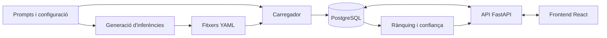

# Descripció del sistema

Arena Cat recull comparacions humanes entre respostes de models d'IA en català.
Les respostes es generen abans de l'avaluació i es carreguen a PostgreSQL.
Durant una votació, el servidor selecciona dues respostes desades: no executa
cap model en temps real.

La [motivació i la metodologia](projecte.md) expliquen què es vol mesurar.
Aquest document descriu els components, les dades i el funcionament de
l'aplicació. El [README](../README.md) conté l'arrencada ràpida.

## Arquitectura



| Component | Responsabilitat | Codi |
|---|---|---|
| Canonada d'inferència | Executa els models sobre els prompts i desa les respostes i les metadades | [`scripts/`](../scripts/README.md) |
| Carregador | Sincronitza categories i insereix prompts i respostes | [`carrega_inferencies.py`](../scripts/carrega_inferencies.py) |
| Backend | Autenticació, qualificació, tasques, vots, omissions, progrés i rànquing | [`backend/`](../backend/README.md) |
| Frontend | Interfície d'avaluació i consulta pública del rànquing | [`frontend/`](../frontend/README.md) |
| Base de dades | Persistència amb SQLAlchemy i migracions Alembic sobre PostgreSQL | [Esquema de dades](db_schema.md) |
| Simulador | Estimació del volum de comparacions i de l'esforç dels avaluadors | [`simulador/`](../simulador/) i [dimensionament](avaluadors.md) |

El frontend fa servir React, TypeScript, Vite i Tailwind. En desenvolupament,
Vite reenvia les peticions `/api` al backend, de manera que el navegador
treballa amb un sol origen. El backend exposa una API FastAPI amb validació
de peticions mitjançant Pydantic.

## Prompts i inferències

### Categories i models

El [catàleg de categories](../data/prompts/categories.yaml) defineix els noms,
les descripcions i els consells que veu l'avaluador. Les categories actuals són
generació, correcció, reformulació i traducció.

La [configuració d'inferència](../config/inferencia/inferencia_config.yaml)
defineix els models i les opcions d'execució. Actualment inclou:

| Model | Identificador del model d'origen |
|---|---|
| Qwen 3.8 27B | `Qwen/Qwen3.8-27B` |
| Mistral Small 3.2 24B Instruct | `mistralai/Mistral-Small-3.2-24B-Instruct-2506` |
| Gemma 4 26B A4B Instruct | `google/gemma-4-26B-A4B-it` |

L'analitzador de prompts llegeix aquesta mateixa configuració per obtenir la
llista de models. Les opcions inclouen la revisió, el tipus numèric, la
quantització, els paràmetres de generació i la instrucció de sistema.
La canonada utilitza Transformers i també disposa d'un camí específic amb
`mistral_common` per al model Mistral configurat.

Els prompts han de permetre comparar les respostes amb criteri lingüístic:
instruccions clares, textos assumibles per a una lectura humana i varietat de
dificultat i registre. El seu format és text pla; la categoria es dedueix del
prefix del nom del fitxer.

### Generació i càrrega

Els fitxers segueixen aquesta estructura:

```text
data/prompts/<version>/<code>.txt
data/inferencies/<version>/<model_id>/<code>.yaml
```

[`inferencia.py`](../scripts/inferencia.py) llegeix els prompts i genera un
YAML per model i prompt. Hi desa la resposta, informació del model i de
l'execució, paràmetres de generació i un fingerprint per decidir si pot
reutilitzar un resultat existent. La seed registrada i les metadades ajuden
a identificar l'execució; no garanteixen per si soles una reproducció exacta.

[`carrega_inferencies.py`](../scripts/carrega_inferencies.py) importa aquests
fitxers a la base de dades. La càrrega és idempotent per `(version, code)` en
els prompts i per `(prompt_id, model)` en les respostes. Recarregar dades
idèntiques no crea duplicats. Els conflictes de text o de metadades de resposta
conservades es rebutgen; cal publicar una versió nova. El raonament intern,
quan n'hi ha, es desa a les metadades i no es mostra com a resposta.

Les inferències de referència es mantenen a la branca `dades_inferencia`.
`make load_reference_inferences` crea o reutilitza el worktree
`../arena-cat-dades-inferencia` i crida el carregador amb les dades d'aquella
branca. Per generar dades locals es fan servir `make inferences` i
`make load_inferences`. La generació pot requerir `HF_TOKEN` i memòria suficient;
la configuració `config/inferencia/inferencia_local_config.yaml` permet provar
la canonada amb un model petit.

Les comandes, els filtres i les opcions es detallen a la
[guia de la canonada](../scripts/README.md).

### Versions actives

`code` identifica un prompt concret, per exemple `traduccio_3`; `version`
identifica una revisió del seu text. Cada revisió té un `prompt_id` propi, al
qual apunten les respostes, els vots i les omissions.

Per a cada `code`, la versió activa és la més alta numèricament entre les que
tenen almenys dues respostes de models diferents. Les etiquetes tenen el format
`v<N>`, amb un enter positiu sense zeros inicials. Així, `v10` és posterior a
`v9`. No cal actualitzar tots els prompts alhora.

Si es carrega `traduccio_3/v2` amb una sola resposta, v1 continua activa. Quan
v2 té la segona resposta, substitueix v1 en les tasques, el progrés, el rànquing,
la confiança i el recompte de participants. Els vots de v1 es conserven com a
historial i a l'exportació personal, però no es traslladen a v2 ni compten en
els resultats vigents. Recarregar v1 no la reactiva.

La consulta comuna és a [`prompt_versions.py`](../backend/app/prompt_versions.py).
Si una tasca oberta correspon a una versió que ja no és activa, votar-la o
ometre-la retorna HTTP 410 i el frontend demana una altra tasca.

## Recorregut de l'avaluador

1. La persona es registra amb correu, contrasenya i consentiment explícit.
2. Si `REQUIRE_EMAIL_VERIFICATION` està activat, verifica el correu mitjançant
   l'enllaç rebut abans d'iniciar sessió.
3. Supera la prova de competència lingüística. El
   [qüestionari](../data/qualification.yaml) actual té deu preguntes i exigeix
   vuit encerts. L'acreditació queda desada a `users.qualified_at`.
4. Rep un prompt i dues respostes anònimes, amb la possibilitat de filtrar per
   categoria. A correcció, pot veure les diferències respecte del text original.
5. Després de l'espera mínima de deu segons, vota A, B, empat o cap de les dues.
   També pot ometre la tasca. La interfície actualitza el progrés i en demana
   una altra.

La tasca en curs es conserva a `sessionStorage` per poder recuperar-la després
d'una recàrrega. En tancar la sessió es descarta. El frontend també ofereix
verificació del correu, recuperació de contrasenya, un tutorial i una pàgina
explicativa del projecte. La portada sense sessió mostra el rànquing públic.

### Selecció i registre de tasques

El selector considera cada combinació de prompt actiu i parella de models com
una cel·la. Dins de la categoria, tria aleatòriament entre les cel·les amb menys
vots i exclou les que l'usuari ja ha votat o omès. L'ordre de les respostes A/B
també és aleatori. Sense filtre de categoria, el servei recorre les categories
en ordre alfabètic fins a trobar feina pendent.

L'API no revela els noms dels models a la tasca. Retorna un token signat amb
HMAC que vincula l'usuari, el prompt i les respostes, i inclou la caducitat i
l'instant a partir del qual es pot votar. El servidor comprova aquests valors
quan rep el vot.

| Endpoint | Funció |
|---|---|
| `GET /api/categories` | Catàleg de categories i consells d'avaluació |
| `GET /api/task` | Propera comparació disponible |
| `POST /api/vote` | Registre de la preferència |
| `POST /api/task/skip` | Registre d'una omissió |
| `GET /api/task/progress` | Total de duels, votats, omesos i pendents de l'usuari |
| `GET /api/ranking` | Rànquing global o per categoria i estadístiques associades |

Les tasques, els vots, les omissions i el progrés exigeixen sessió i
qualificació. El contracte de l'API es descriu al [README del backend](../backend/README.md).

## Persistència i comptes

PostgreSQL conserva `categories`, `prompts`, `responses`, `users`, `sessions`,
`votes` i `task_skips`. Les claus foranes garanteixen que les dues respostes
d'un vot pertanyen al mateix prompt. Les restriccions d'unicitat impedeixen
duplicar una resposta del mateix model i repetir un vot del mateix usuari per
parella, independentment de l'ordre A/B. Les omissions tenen una restricció
equivalent a la seva taula.

Les contrasenyes es desen amb Argon2id. Les sessions utilitzen tokens opacs
en cookies `HttpOnly`; a la base de dades se'n desa el hash. Els atributs
`Secure`, `SameSite` i la durada es configuren a l'entorn.

La baixa del compte exigeix la contrasenya, elimina el correu i les credencials
i revoca les sessions. Es preserven l'identificador de l'usuari, els vots i
l'`email_hash` utilitzat per impedir el re-registre. L'API permet exportar les
dades personals i tots els vots del compte. La baixa i l'exportació estan
disponibles a l'API; el frontend encara no ofereix pantalles per a aquestes
operacions.

Els correus de verificació i recuperació de contrasenya s'envien per SMTP amb
plantilles de text i HTML. Sense `SMTP_HOST`, el missatge queda al log per
facilitar les proves locals. `FRONTEND_BASE_URL` determina l'origen dels
enllaços inclosos en aquests correus.

Vegeu l'[esquema de dades](db_schema.md), la
[documentació d'autenticació](usuaris_autenticacio.md) i la
[guia de proves manuals](auth_flow_manual.md).

## Rànquing

El rànquing global o per categoria ajusta un model Bradley–Terry als vots
decisius de les versions actives. Els empats i els vots «cap de les dues» es
compten separadament. La resposta pública inclou les puntuacions i posicions
dels models, el nombre de vots i de participants i les mesures de confiança.

La confiança s'estima amb bootstrap agrupat per prompt. La interfície fa
servir el resultat d'estabilitat per indicar si el rànquing és provisional.
Els algoritmes són a [`backend/app/ranking/`](../backend/app/ranking/); el
[document de disseny estadístic](T7_ranking_design.md) recull la justificació
i els experiments, i el [dimensionament](avaluadors.md) estima l'esforç humà.

## Execució i desplegament

En local, [Docker Compose](../docker-compose.yml) aixeca PostgreSQL 16 i l'API.
El volum de PostgreSQL conserva les dades entre arrencades. La inicialització
crea un rol d'aplicació amb permisos limitats i una base de dades separada per
a les proves. Les migracions Alembic utilitzen el rol administrador.

La configuració es llegeix del `.env` de l'arrel i de les variables d'entorn;
[`.env.example`](../.env.example) en recull les opcions. Els targets `make` no
sobreescriuen un `.env` existent. En actualitzar una instal·lació, cal revisar
si falten variables; per exemple, si encara no hi ha `HMAC_SECRET_KEY`:

```bash
printf 'HMAC_SECRET_KEY=%s\n' "$(openssl rand -hex 32)" >> .env
```

El repositori defineix tres imatges:

- [`backend/Dockerfile`](../backend/Dockerfile): aplica les migracions i arrenca
  l'API amb Uvicorn al port 8000.
- [`frontend/Dockerfile`](../frontend/Dockerfile): compila el frontend i serveix
  els fitxers estàtics amb un servidor Node al port 80, amb retorn d'`index.html`
  per a les rutes de l'aplicació. `VITE_API_BASE_URL` es fixa en compilar.
- [`Dockerfile.load-inferences`](../Dockerfile.load-inferences): incorpora els
  prompts i les inferències v1 i executa el carregador.

La [configuració de GitLab CI](../.gitlab-ci.yml) construeix i publica aquestes
imatges i delega el desplegament al projecte d'infraestructura. Per construir
la imatge de càrrega, recupera les inferències de la branca `dades_inferencia`.

Per carregar les inferències precomputades en un entorn desplegat, amb el
fitxer de credencials `.env_loader` i la xarxa de PostgreSQL preparats:

```bash
docker run --rm --network arena-cat_arena_cat --env-file .env_loader \
  registry.softcatala.org/github/arena-cat/arena-cat-load-inferences:main
```

El nom de la xarxa i el fitxer d'entorn han de correspondre al desplegament.
La terminació HTTPS i les polítiques HTTP del proxy es configuren a la
infraestructura que publica el servei.

## Comprovacions

Els tests del backend utilitzen PostgreSQL amb transaccions aïllades per prova.
Cobreixen el model de dades, l'API, la càrrega, la selecció, el versionatge i
els càlculs del rànquing. Les proves de la canonada poden substituir els models
i tokenitzadors per dobles de prova, sense descarregar models grans.

[GitHub Actions](../.github/workflows/ci.yml) executa les migracions, els tests
i Ruff al backend, i la comprovació de tipus, el format i la compilació del
frontend. Les comandes locals són als README del
[backend](../backend/README.md), del [frontend](../frontend/README.md) i de la
[canonada](../scripts/README.md).
