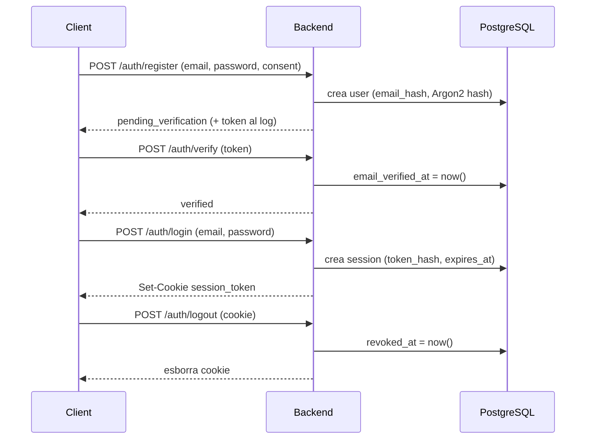

# Gestió i autenticació d'usuaris

Documentació detallada del subsistema d'usuaris i autenticació del backend d'Arena Cat:
model de dades, criptografia, fluxos d'autenticació, autorització, endpoints i RGPD.

> Codi de referència: [`backend/app/models.py`](../backend/app/models.py),
> [`backend/app/security.py`](../backend/app/security.py),
> [`backend/app/services/auth_service.py`](../backend/app/services/auth_service.py),
> [`backend/app/routes/auth.py`](../backend/app/routes/auth.py).

## Visió general

Arena Cat recull vots humans que comparen respostes de models d'IA. Per garantir la
qualitat de les dades, només poden votar **usuaris registrats i amb el correu verificat**.
El sistema d'autenticació és responsable de:

- Registrar avaluadors amb correu, contrasenya i **consentiment explícit**.
- Verificar la propietat del correu mitjançant un token signat.
- Autenticar l'usuari i mantenir una **sessió** basada en cookie.
- Autoritzar les operacions sensibles (obtenir tasques i votar) a usuaris verificats.
- Complir el RGPD: exportació de dades i baixa amb anonimització.

El disseny minimitza les dades personals emmagatzemades i prioritza les garanties
criptogràfiques i a nivell de base de dades per sobre de la validació a l'aplicació.

## Model de dades

L'autenticació s'articula sobre dues taules: `users` i `sessions`. El diagrama complet
és a [docs/db_schema.md](db_schema.md).

### Taula `users`

| Columna | Tipus | Descripció |
| --- | --- | --- |
| `id` | `bigint` PK | Identificador intern de l'usuari. |
| `email` | `varchar(255)` únic, *nullable* | Correu en clar de l'usuari actiu. S'anul·la en donar-se de baixa. |
| `email_hash` | `varchar(64)` únic, *nullable* | HMAC-SHA256 del correu normalitzat. Es conserva després de la baixa per detectar re-registres. |
| `password_hash` | `text` *nullable* | Hash Argon2id de la contrasenya. |
| `email_verified_at` | `timestamptz` *nullable* | Moment de verificació del correu. `NULL` mentre no s'ha verificat. |
| `consent_version` | `varchar(32)` | Versió del consentiment acceptada al registre. |
| `consent_at` | `timestamptz` *nullable* | Moment en què es va donar el consentiment. |
| `created_at` | `timestamptz` | Data d'alta (per defecte `now()`). |
| `deleted_at` | `timestamptz` *nullable* | Marca de baixa. Si té valor, l'usuari està anonimitzat. |

**Restricció d'integritat** (`ck_users_active_have_credentials`): un usuari actiu
(`deleted_at IS NULL`) ha de tenir sempre `email`, `email_hash`, `password_hash` i
`consent_at`. Això garanteix a nivell de base de dades que no existeixin comptes actius
sense credencials ni consentiment; només els comptes donats de baixa poden tenir aquests
camps a `NULL`.

El correu es guarda **dues vegades**: en clar (`email`) per poder operar-hi i com a hash
(`email_hash`) per poder comprovar la unicitat i detectar re-registres fins i tot després
d'haver anonimitzat el compte, quan `email` ja no existeix.

### Taula `sessions`

| Columna | Tipus | Descripció |
| --- | --- | --- |
| `id` | `bigint` PK | Identificador de la sessió. |
| `user_id` | `bigint` FK → `users.id` | Usuari propietari de la sessió (indexat). |
| `token_hash` | `varchar(64)` únic | HMAC-SHA256 del token de sessió. Mai es desa el token en clar. |
| `created_at` | `timestamptz` | Data de creació de la sessió. |
| `expires_at` | `timestamptz` | Caducitat de la sessió (TTL de 24 h). |
| `revoked_at` | `timestamptz` *nullable* | Marca de revocació (logout o baixa). |

Una sessió es considera **activa** quan `revoked_at IS NULL` i `expires_at` és al futur.
El token real només existeix al navegador (cookie); a la base de dades només se'n guarda
el hash, de manera que una filtració de la taula `sessions` no permet suplantar ningú.

### Relació amb els vots

La taula `votes` referencia `users.id` amb `ON DELETE SET NULL`. Quan un usuari es dona de
baixa **no** s'esborren els seus vots: es desvinculen (o es preserven anonimitzats), de
manera que les dades agregades del rànquing es mantenen íntegres.

## Criptografia i secrets

Tota la lògica criptogràfica viu a [`backend/app/security.py`](../backend/app/security.py).

### Contrasenyes — Argon2id

Les contrasenyes es xifren amb **Argon2id** (via `argon2-cffi`):

- `hash_password(password)` genera el hash que es desa a `users.password_hash`.
- `verify_password(password, password_hash)` el comprova; captura `VerifyMismatchError`
  i retorna `False` en cas d'error, sense filtrar detalls.

Argon2id és una funció de derivació de clau resistent a atacs per GPU i inclou la sal a la
pròpia sortida, de manera que no cal gestionar-la per separat.

### Hash del correu — HMAC-SHA256 amb pepper

`compute_email_hash(email)` normalitza el correu (`strip().lower()`) i en calcula un
HMAC-SHA256 amb el secret `email_hash_pepper`. El *pepper* és un secret global (no
emmagatzemat amb les dades) que evita que un atacant amb accés a la base de dades pugui
comprovar per força bruta si un correu concret hi és present. Aquest hash és la clau que
permet detectar re-registres després d'una baixa.

### Tokens signats — HMAC-SHA256 + expiració

Els tokens de verificació de correu i els tokens de tasca són **payloads JSON signats**
(no xifrats) amb el format `base64url(payload).base64url(signatura)`:

- `_sign_payload(payload, secret)` serialitza el payload i hi afegeix una signatura
  HMAC-SHA256 amb `hmac_secret_key`.
- `_verify_signed_payload(token, secret)` recalcula la signatura i la compara amb
  `hmac.compare_digest` (comparació en temps constant, resistent a *timing attacks*), i
  rebutja el token si el camp `exp` ja ha passat.

Tokens derivats:

- `create_email_verification_token(user_id, email)` / `verify_email_verification_token(token)`
  — TTL de **24 h**, amb `purpose="email_verify"` que es valida explícitament.
- `create_task_token(...)` / `verify_task_token(token)` — TTL d'**1 h**, per lligar una
  tasca de votació a un usuari (fora de l'abast d'aquest document; vegeu el flux de vots).

### Tokens de sessió — token opac + hash

- `new_session_token()` genera un token opac aleatori amb `secrets.token_urlsafe(32)`.
  Aquest és el valor que rep el client dins la cookie.
- `hash_session_token(token)` en calcula l'HMAC-SHA256 amb el secret `session_secret`;
  aquest hash és el que es desa a `sessions.token_hash` i el que es fa servir per buscar
  la sessió. Així, el valor sensible mai toca la base de dades.

### Secrets de configuració

Definits a [`backend/app/config.py`](../backend/app/config.py) i llegits de l'entorn o del
fitxer `.env` (mai s'ha de versionar):

| Secret | Ús |
| --- | --- |
| `hmac_secret_key` | Signatura dels tokens de verificació de correu i de tasca. |
| `session_secret` | Hash dels tokens de sessió. |
| `email_hash_pepper` | Derivació de `email_hash`. |
| `consent_version` | Versió de consentiment que es registra a l'alta (per defecte `v1`). |
| `session_ttl_hours` | Durada de la sessió i de la cookie associada. |
| `cookie_name` | Nom de la cookie de sessió. |
| `cookie_secure` | Si la cookie només viatja per HTTPS (`true` a producció). |
| `cookie_samesite` | Política `SameSite` de la cookie (`lax`, `strict` o `none`). |

## Flux d'autenticació

### 1. Registre (`register_user`)

1. Es rebutja el registre si `consent` no és cert (HTTP 400).
2. Es normalitza el correu i se'n calcula l'`email_hash`.
3. Es busca un usuari existent amb el mateix `email_hash`:
   - Si existeix i està donat de baixa → HTTP 409 («Aquest correu ja s'havia registrat»).
   - Si existeix i està actiu → HTTP 409 («Aquest correu ja està registrat»).
4. Es xifra la contrasenya amb Argon2id i es crea l'usuari amb `consent_version` i
   `consent_at`.
5. Es genera un **token de verificació** (24 h). A la v1 no hi ha servei de correu: el
   token s'escriu al *log* perquè es pugui provar el flux manualment.
6. Es retorna l'estat `pending_verification`.

### 2. Verificació de correu (`verify_email`)

1. Es valida el token signat (signatura, expiració i `purpose="email_verify"`); si no és
   vàlid → HTTP 400.
2. Es carrega l'usuari; si no existeix o està donat de baixa → HTTP 404.
3. Es comprova que el correu del token coincideix amb el de l'usuari → HTTP 400 si no.
4. Si encara no estava verificat, s'estableix `email_verified_at`. L'operació és
   **idempotent**: reverificar no dona error.
5. Es retorna l'estat `verified`.

### 3. Login (`login_user`)

1. Es busca l'usuari pel correu normalitzat; si no existeix o està de baixa → HTTP 401
   (missatge genèric «Email o contrasenya incorrectes» per no revelar l'existència del
   compte).
2. Si el correu no està verificat → HTTP 403.
3. Es verifica la contrasenya amb Argon2id; si falla → HTTP 401 (mateix missatge genèric).
4. Es crea una sessió: token opac, hash a `token_hash` i `expires_at` a 24 h.
5. La ruta estableix la cookie `session_token` (vegeu [Seguretat de cookies](#seguretat-de-cookies)).

### 4. Sessió i logout (`logout_user`)

- Cada petició autenticada envia la cookie `session_token`; el backend en calcula el hash
  i busca una sessió **activa**.
- El logout calcula el hash del token i, si troba la sessió, hi estableix `revoked_at`.
  Sempre s'esborra la cookie del client, hi hagi sessió o no.

## Autorització

La funció [`resolve_session_user`](../backend/app/services/auth_service.py) resol l'usuari
a partir de la cookie de sessió i protegeix els endpoints que requereixen un usuari
autenticat i verificat (per exemple, obtenir tasques a
[`routes/task.py`](../backend/app/routes/task.py) i votar a
[`routes/vote.py`](../backend/app/routes/vote.py)). Amb `require_verified=True` comprova,
en aquest ordre:

1. Que hi hagi cookie `session_token` (si no → HTTP 401).
2. Que existeixi una sessió activa (`revoked_at IS NULL` i `expires_at` al futur) → HTTP 401.
3. Que l'usuari existeixi i no estigui donat de baixa → HTTP 401.
4. Que el correu estigui verificat (`email_verified_at` no nul) → HTTP 403.

Si totes les comprovacions passen, retorna l'objecte `User` per injectar-lo a l'endpoint.
Els endpoints d'exportació i baixa reutilitzen la mateixa funció sense exigir verificació.

## Referència d'endpoints

Tots els endpoints pengen del prefix d'autenticació definit a
[`backend/app/routes/auth.py`](../backend/app/routes/auth.py).

| Mètode | Ruta | Cos de petició | Resposta | Errors |
| --- | --- | --- | --- | --- |
| `POST` | `/auth/register` | `{ email, password, consent }` | `{ status: "pending_verification" }` | 400 (sense consentiment), 409 (correu ja registrat) |
| `POST` | `/auth/verify` | `{ token }` | `{ status: "verified" }` | 400 (token invàlid), 404 (usuari no trobat) |
| `POST` | `/auth/login` | `{ email, password }` | `{ status: "logged_in" }` + cookie | 401 (credencials), 403 (correu no verificat) |
| `POST` | `/auth/logout` | *(cookie)* | `{ status: "logged_out" }` | — |
| `POST` | `/auth/delete-account` | `{ current_password }` + cookie | `{ status: "deleted" }` | 401 (sessió/contrasenya) |
| `GET` | `/auth/export` | *(cookie)* | `{ user, votes }` | 401 (sessió) |

Els esquemes de petició i resposta són a [`backend/app/schemas.py`](../backend/app/schemas.py).

## Compliment del RGPD

### Exportació de dades (`export_user_data`)

L'endpoint `GET /auth/export` requereix una sessió activa i retorna:

- Les dades del compte (`ExportUserResponse`): `id`, `email`, `email_verified_at`,
  `consent_version`, `consent_at`, `created_at`, `deleted_at`.
- Tots els vots de l'usuari (`ExportVoteResponse`), ordenats cronològicament.

Això dona resposta al **dret d'accés i portabilitat** de les dades personals.

### Baixa i anonimització (`delete_account`)

L'endpoint `POST /auth/delete-account` implementa el **dret a l'oblit**:

1. Exigeix una sessió activa i la **contrasenya actual** (reautenticació) → HTTP 401 si
   falla qualsevol de les dues.
2. Anonimitza l'usuari amb `anonymize_user_rgpd`: buida `email`, `password_hash`,
   `email_verified_at` i `consent_at`, i estableix `deleted_at`. **Es conserven `id` i
   `email_hash`** per poder detectar futurs re-registres del mateix correu.
3. Revoca **totes** les sessions actives de l'usuari.
4. S'esborra la cookie del client.

Com que `votes.user_id` és `ON DELETE SET NULL` i l'anonimització no esborra la fila de
l'usuari, els vots emesos es mantenen per a l'anàlisi agregada sense quedar vinculats a
una identitat.

## Configuració i seguretat

### Seguretat de cookies

La cookie de sessió que estableix el login té els atributs següents:

- `HttpOnly` — inaccessible des de JavaScript, mitiga l'exfiltració via XSS.
- `SameSite=Lax` — mitiga CSRF en navegacions entre llocs.
- `max_age=86400` — 24 h, coherent amb el TTL de la sessió al servidor.
- `Secure` — **actualment `False`** per permetre proves en local sense HTTPS.

> ⚠️ **Producció:** cal establir `cookie_secure=true` perquè la cookie només viatgi per HTTPS.
> El CORS es gestiona al *reverse proxy* (Traefik), no a l'aplicació.

### Limitacions de la v1 i notes de producció

- **Sense servei de correu:** el token de verificació s'escriu al *log*; cal integrar un
  servei d'enviament abans de sortir a producció.
- **Cookie no `Secure`:** vegeu la nota anterior.
- **Neteja de sessions:** les sessions caducades es filtren en consulta, però no hi ha una
  tasca que elimini físicament les files expirades o revocades.
- **Secrets:** `hmac_secret_key`, `session_secret` i `email_hash_pepper` han de ser valors
  forts i secrets; canviar-los invalida, respectivament, els tokens signats, les sessions
  actives i la correspondència d'`email_hash`.
