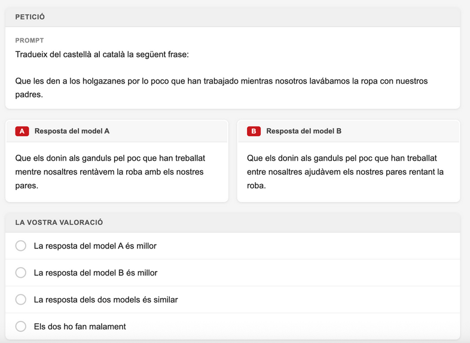

# Arena Cat — Explicació del projecte

**Avaluació humana de models d'IA en català.**

Volem desenvolupar una plataforma participativa, inspirada en [LMSYS Chatbot Arena](https://lmarena.ai/), centrada exclusivament a mesurar la **competència en llengua catalana** dels models de llenguatge gran (LLMs).

A diferència de les [avaluacions automàtiques basades en mètriques](https://www.softcatala.org/la-intelligencia-artificial-al-vostre-ordinador-personal/models-dintelligencia-artificial-en-catala-per-usar-en-local/), aquí són persones les que comparen, a cegues, les respostes de dos models davant d'una mateixa tasca i decideixen quina és millor.

## En poques paraules

- **Què**: rànquing de models LLM segons preferència humana en tasques en català.
- **Com**: comparació cega de parelles de respostes generades prèviament (no en temps real).
- **Qui**: comunitat de Softcatalà, amb un test de qualificació previ.
- **Resultat**: rànquing públic més un conjunt de dades obertes de preferències per a RLHF en català.

## Vols col·laborar-hi? T'estem buscant

Estem **arrencant el projecte** i necessitem reforços. Concretament, busquem:

- 🤖 **Aprenentatge automàtic / IA** — per crear les canonades d'avaluació: executar la inferència dels models, gestionar els *prompts* i preparar les dades que veuran els avaluadors humans.
- 📊 **Estadística** — per dimensionar el volum d'avaluacions, validar la metodologia (Bradley-Terry / Elo) i garantir la robustesa dels rànquings.
- ⚙️ **Python** — per construir la canonada d'inferència, el *backend* (FastAPI + PostgreSQL) i la integració amb la web de Softcatalà.

No cal que dominis les tres àrees: si t'hi veus en alguna, **escriu-nos**. També ens interessa la teva opinió per definir bé les tasques d'avaluació.

Per a ajudar, envia un correu a **Jordi Mas** <jmas@softcatala.org> explicant **com pots col·laborar** i el teu **identificador de Telegram**.

---

# Motivació

Actualment podem [mesurar el rendiment](https://www.softcatala.org/la-intelligencia-artificial-al-vostre-ordinador-personal/models-dintelligencia-artificial-en-catala-per-usar-en-local/) dels models en català, però a part d'una valoració objectiva basada en mètriques d'IA, s'acostuma a donar també molta importància a com d'útils són els models en tasques reals avaluades per humans.

El que succeeix és que l'obsessió actual dels laboratoris que creen els sistemes d'IA per lluir en les mètriques fa que hi hagi una desconnexió important entre el que mostren les mètriques i l'experiència real dels usuaris. Hi ha un **[sobreajustament](https://ca.wikipedia.org/wiki/Sobreajustament_(overfitting))** a les mètriques.

## Per què cal una avaluació humana específica per al català

- Les mètriques agregades poden amagar errors específics de la llengua (ortografia, registre, varietats dialectals, referències culturals).
- L'experiència real dels usuaris catalanoparlants no està reflectida en els *benchmarks* globals.
- No existeix un rànquing públic de models segons la preferència humana en català.

---

# Proposta

Proposem fer una **variació del concepte de Chatbot Arena** adaptada al nostre cas:

- Chatbot Arena avalua els *prompts* que els usuaris volen; nosaltres volem focalitzar-nos només en la **competència dels models en llengua catalana**.
- Aquests sistemes funcionen en temps real: l'usuari proposa una pregunta i dos LLMs responen al moment.
    - Això no ho podem fer perquè ens representa molt cost.
    - En comptes d'això, **generem prèviament les tasques i les respostes** dels models.

## Objectiu inicial

Començaríem amb un objectiu modest:

### Models a avaluar

- Llama 3.1 9B
- Gemma 3 12B
- Qwen 3.5
- Salamandra 7B
- Gemma 4

### Categories de tasques

Generem sintèticament 5 tasques representatives:

| Categoria | Descripció |
|---|---|
| Correcció | Corregeix aquest text |
| Traducció | Tradueix aquest text |
| Resum | Resumeix aquest text |
| Cultura | Contesta una pregunta de cultura catalana |
| Generació | Genera un text |

---

# Com funciona el procés d'avaluació

Demanem a l'usuari que valori quina parella de models ho fa millor per a una tasca concreta.

## Exemple



> **Avaluació cega**: els models s'avaluen de forma cega: l'usuari **no sap** quin model està avaluant en cada cas, per evitar biaixos.

---

# Què cal avaluar

El volum d'avaluacions necessari s'obté de tres factors:

- Els **models** que volem comparar
- Les **tasques** en què els posem a prova
- La **robustesa estadística** que volem assolir

## Quantes comparacions calen?

1. **Nombre de parelles de models**: $C(n, 2) = n \times (n-1) / 2$. Per a 5 models, són **10 parelles**.
2. **Nombre de categories de tasca**: 5 (correcció, traducció, resum, cultura, generació). Cada parella s'avalua en cada categoria, donant $10 \times 5 = 50$ combinacions úniques.
3. **Variacions per categoria**: 10 prompts diferents per categoria, per capturar varietat de dificultat i estil. Això vol dir 50 prompts en total i $10 \times 50 = 500$ ítems d'avaluació únics (parella × prompt).
4. **Repeticions per combinació**: amb un marge d'error del 5% i un 95% de confiança, calen **385 vots** per cada (parella × categoria) per poder afirmar amb solidesa quin model va millor en aquella tasca.

> **Total**: 50 × 385 = 19.250 avaluacions humanes. Cada *prompt* individual rebrà ~38 vots de mitjana, repartits entre les diferents parelles que el toquin.
>
> Si cada parella requereix uns 2 minuts: $19.250 \times 2 / 60 \approx 641$ hores.

## Reducció amb rànquing global

Si fem servir un sistema de rànquing global tipus **[Bradley-Terry](https://en.wikipedia.org/wiki/Bradley%E2%80%93Terry_model)** o **[Elo](https://ca.wikipedia.org/wiki/Sistema_de_puntuaci%C3%B3_Elo)** (com fa LMSYS Chatbot Arena), el sistema aprofita la transitivitat: si sabem que A > B i B > C, ja tenim informació indirecta sobre A vs C.

Això:

- Redueix significativament els vots necessaris per obtenir un rànquing estable.
- Permet treballar amb dades **desbalancejades** — no cal que totes les parelles tinguin el mateix nombre de votacions.

---

# Qui fa l'avaluació

La idea és muntar una **web participativa** dins del lloc de Softcatalà on els usuaris ens ajudin a fer aquest procés. Seria similar al que vam fer amb [Common Voice](https://commonvoice.mozilla.org/), on la gent contribuïa una estona a fer tasques.

## Test de qualificació

Abans que un usuari pugui començar a contribuir, la primera vegada haurà de fer un **petit test de 5 preguntes** per comprovar que té criteri per fer l'avaluació.

## Registre d'usuaris

Per evitar el vandalisme i garantir la qualitat, mantindrem un **registre d'usuaris** amb nom i contrasenya.

> **Inspiració**: l'enfocament participatiu segueix la línia de [Common Voice](https://commonvoice.mozilla.org/) i [VoiceArena](https://voicearena.com/) — contribucions petites i acumulables d'una comunitat àmplia.

---

# Què cal fer

Llista de feines necessàries per posar en marxa el projecte.

## Tasques d'avaluació

- [ ] **Crear les tasques a avaluar**
    - Han de representar tasques **reals** i tenir **diferents nivells de complexitat**.
    - No és senzill: estaria bé demanar *feedback* públicament abans de tancar-les.

## Plataforma

- [ ] **Desenvolupar l'aplicació** d'avaluació o adaptar-ne alguna d'existent.
- [ ] **Llançar el procés internament** dins de Softcatalà.
- [ ] **Fer-lo créixer** a través de xarxes socials i la web.

---

# Resultats del projecte

El projecte generaria dos resultats principals:

## 1. Rànquing públic de models

Mantenir un **rànquing dels millors models per al català** segons preferència humana, actualitzat a mesura que arriben nous vots i nous models.

## 2. Conjunt de dades obertes de preferències

Un cop acabat el procés, es publicarà en obert el **conjunt de dades de preferències** amb l'estructura:

```
Prompt + Resposta A + Resposta B + Guanyador
```

> **Per què importa**: aquest conjunt de dades permetria a altres investigadors fer **RLHF** (*Reinforcement Learning from Human Feedback*) específic per al català, contribuint a millorar la qualitat dels models de la llengua a llarg termini.

---

# Full de ruta

El projecte avançarà per versions, començant per una validació de concepte abans d'escalar a tots els models i totes les categories.

## Versions

- **Versió 1.0 — Validació del concepte** (a sota): abast reduït (3 models, 3 categories) per provar la mecànica i la interfície.
- *Versions futures*: ampliar models, categories, *prompts* per categoria i objectiu de vots fins a assolir robustesa estadística.

---

# Versió 1.0 — Validació del concepte

**Objectiu d'ús**: 40 hores de contribucions humanes.

## Abast

### Models (3)

- Gemma 3 12B
- Qwen 3.5 9B
- **Gemma 4 26B A4B**

### Categories (3)

3 models × 3 categories prioritàries (**correcció**, **cultura** i **traducció**) — les més específiques de català, on els models globals tendeixen a fallar més — × 10 *prompts* = **30 prompts**.

Per (parella × categoria) tenim aproximadament $1.200 / 9 \approx 133$ vots. Marge ≈ **8,5%**.

> **Compromís**: sacrifiquem **amplitud** per **profunditat** en aquesta primera versió.

## Components a desenvolupar

### Preparació de les dades

**Preparació de preguntes**

- 50 tasques: 10 exemples per cadascuna de les 5 categories.

**Canonada de pre-processament**

- Inferència dels models seleccionats i desat en fitxers de metadades.

### Gestió d'usuaris

- Test de qualificació
- Persistència de dades

### Interfície d'usuari

- Pàgina a la web de Softcatalà que permet **registrar-se** i **avaluar**.
- Mostra l'**objectiu** i com estem respecte a ell.

### Backend

**FastAPI amb 3 endpoints:**

- `GET` de tasca aleatòria
- `POST` de vot
- `GET` d'estadística senzilla

**Persistència**: PostgreSQL + model de dades.

## Estimació

> **Esforç**: punt mig realista — **~120 hores de desenvolupament**.


